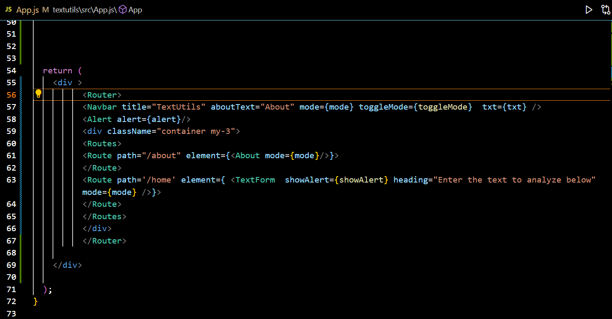
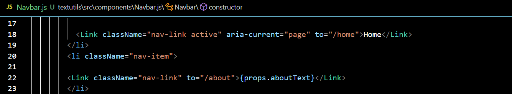
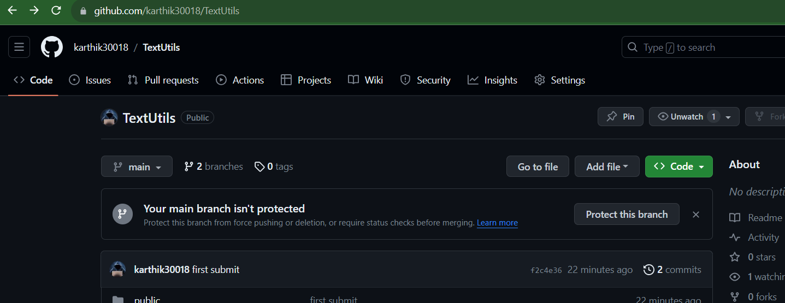
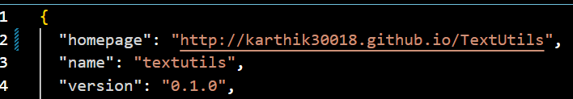
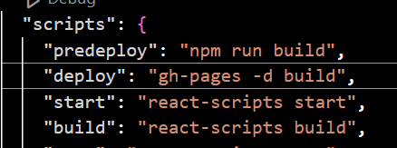
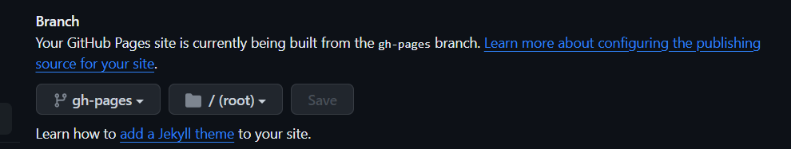
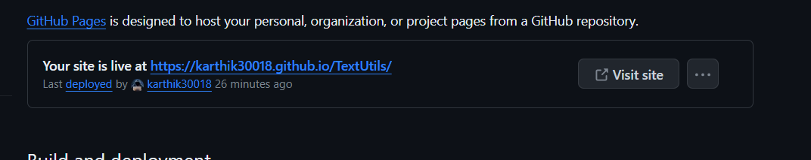

# Day  1

## React 

React is a JavaScript library for rendering user interfaces (UI). UI is built from small units like buttons, text, and images. React lets you combine them into reusable, nestable components. From web sites to phone apps, everything on the screen can be broken down into components.

- **Single Page Application**

npm - **Node Package Manager**  
    - the default package manager for Node.js and is written entirely in Javascript.

### How to create react app

1. Create a folder ,open it in vs code.
2.  Open terminal and type
   `npx create-react-app my-app`

   npx - **Node Package Execute** and it comes with the npm.  
       -  It is an npm package runner that can execute any package that you want from the npm registry without even installing that package.

- my-app - is the project name(you can give what ever name you want).

3. To start react project `npm start`.
   

   ```
   npx create-react-app my-app
   npm start
   ```

## Introduction to jsx 

- Instead of artificially separating technologies by putting markup and logic in separate files, React separates concerns with loosely coupled units called “components” that contain both.
- React has two types of componenets
  1. Function based componenet(presently it is used widly)
  2. Class based componenet

- jsx is nothing but a html in react with some changes in the syntax.
- Every thing which is written inside a function's return statement is called jsx.
- Every thing should be wrapped inside a **div** tag
- **babel** is used to **compile** the jsx code into React.createElement() calls.

## Embedding Expressions in JSX

```
const name = 'coder';
const element = <h1>Hello, {name}</h1>;
```

## To include bootstarp in react

- open bootstrap website and copy **script** tag and past it in **index.html**(after body tag terminates) in react app.
- copy  bootstrap css **link** tag from bootstrap website and past it in **index.html**(inside head tag) in react app.

# Day 2

## export

- Named export

```
  module1.js
  const a= "abc";
  const b= "xyz";
  const c= "123";
  const d= "103";

  export {a};
  export {b};
  export {c};
  ```

  ```
  module2.js
  import {a,b,c} './module1.js'
  console.log(a)
  console.log(b)
  ```
  here we have to use the same name as exported name if we didn't use the **default** keyword. 


- Default export
  
  ```
  module1.js
  export default name_of_the_item to_be_export;

  eg.
  const a= "abc";
  const b= "xyz";
  const c= "123";
  const d= "103";

  export default a;
  
  ```
  ```
  module2.js
  import any_name from './module1.js'
  console.log(any_name)

  eg.
  import data from './module1.js'
   console.log(data)
  
  ```
  in the above example ,the exported item in the module1.js can be imported in any files  by using import statement in the above example of module2.js.  

  **Only one export default statement can be used** 

## Props(Properties) and PropType

- Porps is used to send date to a custom components.

```
eg.
App.js

 <Navbar title="TextUtils"/>

```
```
Navbar.js
function Navbar(props){
   return(
    <div>
    <a className="navbar-brand" href="/">{props.title}</a>
   )
}
export default Navbar
```
This function is a valid React component because it accepts a single “props” (which stands for properties) object argument with data and returns a React element. We call such components “function components” because they are literally JavaScript functions.

- **Props are Read-Only**
- Don't change the props inside the function.

### propType

- propType is used to specify the type of the each props while passing the value.
  
```
eg.
import propTypes from 'prop-types'

Navbar.proptypes={
  title : propTypes.string.isRequired,
  aboutText : propTypes.string.isRequired
}
```
isRequired is used make the field compulsary.


default propType
```
 Navbar.defaultProps = {
    title: 'set title here',
    abourText : 'About text here'
  };
```
it is used if the value is not set then the value of text is displayed in browser


## state

- the user input is stored in a variable and when updated it , it should update where ever it is used without reloading the page.
- belongs to components.

**React Hooks** 
- it is introduce to use useState in function based components.
- used to use features of class without creating a class.


### useState hooks
```
import { useState } from 'react'
      const handleUpClick=()=>{
      // console.log("upperCase was clicked" + text);
      let newText = text.toUpperCase();
      setText(newText);
      }
    
      const handleOnChange=(event)=>{
      //console.log("On change")
      setText(event.target.value)
      }
    const [text , setText]= useState('')
   //setText("hello");


        <div className="mb-3">
        <textarea className="form-control" value={text} placeholder="Enter text year..." onChange={handleOnChange} id="myBox" rows="8"></textarea>
        </div>
        <button className='btn btn-primary' onClick={handleUpClick} >Covert to UpperCase</button>

```
- In the above code to create useState first import useState.
- create useState variable  
  ` const [text , setText]= useState('')`
- text - used to store user input value which is stord inside the usestate()
- setText - used to modify the text variable content.
  
- onChange - onChange in textarea tag is used to make user to input some value ,without this they cannot input the value. 
  
 ```
 `<textarea className="form-control" value={text} placeholder="Enter text year..." onChange={handleOnChange} id="myBox" rows="8"></textarea>`

     const handleOnChange=(event)=>{
      //console.log("On change")
      setText(event.target.value)
      }
  ```

- onClick - inside onClick function we will update the text variable with the help of setText variable.
  
```
<button className='btn btn-primary' onClick={handleUpClick} >Covert to UpperCase</button>

const handleUpClick=()=>{
      // console.log("upperCase was clicked" + text);
      let newText = text.toUpperCase();
      setText(newText);
      }
```

# Day 2

## How to change title dynamically

- Open index.html and in title tag change the name how you required.
- in last meta tag ,in content field specify the working of this web application in less words.
- for icon download suitable item,open favicon generator and use the icon youu downloaded.
- after generating favicon extract the zip folder and sselect any two png and one ico .
- open public in your project folder and delete the ico which is already present and past this 3 icons.
- Then refresh your browser it will appear.

### To change title dynamically
```
document.title = "title name"
```
use this line when ever you want to trigger or change the name of the title(eg.use inside useState)

- To make title change dynamically at perticular interval of time 
 ```
 setInterval(()=>{
  document.title = "title name"
 },2000)
```
use the above code more no of times with different time interval.

## Router

- install react-router-dom package
  
```
 npm insatll react-router-dom
  or 
 npm i react-router-dom 

```
- import this whereever you use router
```
  import {
  BrowserRouter as Router,
  Switch,
  Route,
  Link}from "react-router-dom";
```

 - in App.js wrap everything inside Router tag
 - Create Routes tag and define every route inside Routes tag by using Route tag.Shown in fig given below
 - **exact** can be used inside Route tag to perforn when it matches exactly.





and also use this in the Navbar
- change anchor tag into Link tag and href into to.Shown in fig given below





## Git hub Deployment
- Before deploying run the command **run build app**
-  Upload the react project in github.
- Open **deploy creat react app** website.
- Navigate to Github pages
- Copy the home page link
```
  "homepage": "https://myusername.github.io/my-app",
``` 
- change myusername to your username and my-app into your repository name.
  


eg here is myusername - karthik30018
           my-app     - TextUtils

- then paste the above link in **package.json** in first line inside the flower bracket.




- Run this command in terminal
```
npm install --save gh-pages
```
- In **package.json** inside scripts paste this two lines.
```
"predeploy": "npm run build",
"deploy": "gh-pages -d build",
```
eg.



- Run this command in the terminal.
```
npm run deploy
```

- Now open your repository in github go to **settings**.
- Go to pages in branch make it **gh-pages** 
  

- Above the branch you can find the link where your project is hosted. 
  


# Day 3

## Class based componenets with project(NewsApp)

- render() - is used to compile jsx into html and render the html on the screen.


### JavaScript De-structuring

It is the process of exteacting some attributes from the object.

## To use API from end points

use **Fetch API**  

# Day 4

## React infinite scroller

- install the package `npm i react-infinite-scroll-component`
-  import the `react-infinite-scroll-component`
-  copy the type of scroll you want with related function code and modify according to the needs.
